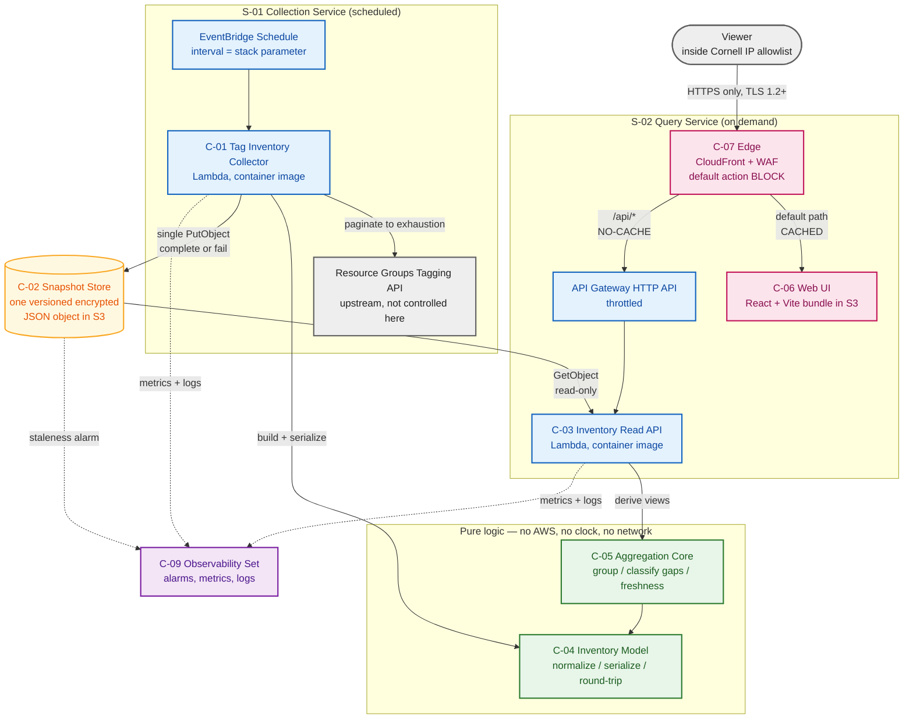
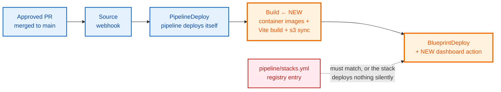

# Component Dependencies — `dashboard` Blueprint

**Stage**: INCEPTION → Application Design (artifact 4 of 5)
**Date**: 2026-08-03

---

## Dependency matrix

Rows depend on columns. `R` = reads, `W` = writes, `C` = calls, `S` = serves through.

| ↓ depends on → | C-01 | C-02 | C-03 | C-04 | C-05 | C-06 | C-07 | Tagging API |
|---|---|---|---|---|---|---|---|---|
| **C-01** Collector | — | W | — | C | — | — | — | R |
| **C-02** Snapshot Store | — | — | — | — | — | — | — | — |
| **C-03** Read API | — | R | — | C | C | — | — | — |
| **C-04** Inventory Model | — | — | — | — | — | — | — | — |
| **C-05** Aggregation Core | — | — | — | C | — | — | — | — |
| **C-06** Web UI | — | — | — | — | — | — | S | — |
| **C-07** Edge | — | — | S | — | — | S | — | — |
| **C-08** Deployment Marker | — | — | — | — | — | — | — | — |
| **C-09** Observability | — | — | — | — | — | — | — | — |

**Three things this matrix is meant to show:**

1. **C-04's row is empty.** It depends on nothing. C-05's row contains only C-04. Neither touches AWS.
   That is §4.5's requirement made structural, and it is what lets PBT-01..10 attach to real units
   rather than to mocked-out AWS calls.
2. **C-01 and C-03 never reference each other.** No column entry links them. Their only relationship
   is that both name C-02 — the invariant from `services.md` read off the matrix.
3. **No cycles.** The graph is a DAG rooted at C-07 and terminating at C-04. Nothing depends on C-02
   except the two functions, and C-02 depends on nothing, so the storage seam cannot introduce one.

C-08 and C-09 have empty rows because they are deployment-time and observation-time artifacts. They
are not called by anything at runtime.

---

## Runtime data flow



The one solid arrow crossing between the two service subgraphs is `STORE → API`, and the one entering
it is `COLL → STORE`. Everything else stays inside its own box. Dotted arrows are telemetry, which by
definition never carries a runtime dependency.

---

## Deployment-time dependencies

Distinct from runtime, and the ones most likely to be got wrong.



| Dependency | Direction | Consequence of getting it wrong |
|---|---|---|
| Build **before** BlueprintDeploy | strict | CloudFormation fails on a missing image tag — reads as a template bug, not a stage-order bug |
| Registry entry **matches** a BlueprintDeploy action | bidirectional | Green PR, all stages `Succeeded`, **no stack**. `validate_stacks.py` now catches both directions. |
| Stack name is `aidlc-<env>-<name>` | strict | Opaque authorization failure, not a naming complaint — `BuildPipelineRole` scopes to `stack/${Application}-${Environment}*` |
| Site bucket exists **before** `s3 sync` | strict | **Unresolved** — see `services.md`; deferred to Infrastructure Design rather than guessed |
| Every parameter passed explicitly | strict | Silent divergence between pipeline and by-hand deploys |

---

## Cross-cutting obligations, and which component owns each

The point of this table is that every one has exactly one owner. An obligation owned by "the design"
is an obligation nobody implements.

| Obligation | Owner | Requirement |
|---|---|---|
| Deny-by-default IP allowlist | C-07 | FR-5.1, SECURITY-07 |
| API path covered by the same ACL | C-07 | FR-5.2 |
| HTTPS only, TLS 1.2+ | C-07 | SECURITY-02 |
| Security response headers, strict CSP | C-07 (set) + C-06 (comply) | SECURITY-11, US-01 |
| **`/api/*` no-cache while site is cached** | C-07 | US-05, and the cost of Q4 = A |
| Encryption at rest | C-02 | SECURITY-01 |
| Least-privilege IAM, per function | C-01, C-03 | SECURITY-06 |
| No internals in error bodies | C-03 | FR-3.4, SECURITY-09 |
| Request validation | C-03 (closed allowlist) | SECURITY-05 |
| Rate limiting | API Gateway under C-03 | FR-3.5, SECURITY-12 |
| Four required tags on every resource | every template | `CLAUDE.md`, FR-1.4 |
| Access logging | C-07 | SECURITY-03, US-11 |
| Application logging | C-01, C-03 | SECURITY-04, US-12 |
| Alarms on the two silent failures | C-09 | US-13, RESILIENCY-07 |
| Bounded concurrency | C-01, C-03 | RESILIENCY-09 |
| Explicit timeouts, bounded retries | C-01, C-03 | RESILIENCY-10 |
| Complete-or-fail collection | C-01 | FR-1.1, US-02 |
| Server-side staleness judgement | C-05, surfaced by C-03 | US-05, Q8 = A |
| Round-trip and determinism properties | C-04 | PBT §4.2 |
| Grouping and gap properties | C-05 | PBT §4.2 |
| Supply-chain pinning, Python + container | C-01, C-03 images | SECURITY-10, US-09 |
| Supply-chain pinning, npm | C-06 lockfile | Q11 = B — **pinning only; no scan, no SBOM** |

The last row is the only obligation in this table that is narrower than the rule it cites. It is
recorded as such in `application-design.md` rather than presented as full compliance.

---
---

# FR-9 / FR-10 extension (2026-08-07)

## Dependency matrix (new components)

| Component | Depends on | Depended on by | Unit |
|---|---|---|---|
| C-10 Cost Collector | Cost Explorer (upstream), C-02, C-12 | — (nothing depends on a collector) | U-02 |
| C-11 Telemetry Collector | CloudWatch (upstream), C-02, C-13, C-14 | — | U-02 |
| C-12 Cost Model + Estimator | **nothing** | C-10, C-03 | U-01 |
| C-13 Telemetry Model | **nothing** | C-11, C-03 | U-01 |
| C-14 Catalog | **nothing** (parser); pipeline build step produces it | C-11, C-03 | U-01 + pipeline |
| C-02 Snapshot Store *(extended)* | — | C-01, C-10, C-11 write; C-03 reads | U-02 |
| C-03 Read API *(extended)* | C-02, C-04, C-05, C-12, C-13, C-14, SSM | C-06 | U-02 |

C-12, C-13 and C-14's parser depend on **nothing** — the same property that makes C-04/C-05
property-testable without AWS, and what keeps `tools/check`'s core-boundary grep passing.

## Data flow

```
                    ┌─────────────── C-02 Snapshot Store (3 keys, 3 owners) ──────────────┐
                    │                                                                     │
 EventBridge hourly │   inventory/current.json  <── C-01  (tag:GetResources)               │
 EventBridge hourly │   telemetry/current.json  <── C-11  (cloudwatch:GetMetricData)       │
 EventBridge daily  │   cost/current.json       <── C-10  (ce:GetCostAndUsage)             │
                    └───────────────────────────────┬─────────────────────────────────────┘
                                                    │  GetObject x3 (independent)
                                                    ▼
   SSM /<app>/<env>/dashboard/model-rates ──────> C-03 Read API ──> C-12 estimate
   C-14 baked catalog (in image) ───────────────>              └──> C-13 derive
                                                    │
                                                    ▼  per-section data + collected_at + state
                                          C-07 edge ──> C-06 UI (Financial / Adoption tabs)
```

## Communication patterns

| Edge | Pattern | Note |
|---|---|---|
| EventBridge → C-10 / C-11 | async, scheduled | Two schedules, two rules; cadences are stack parameters |
| C-10 / C-11 → C-02 | single `PutObject` per run | Complete-or-fail. **No RMW anywhere** (Q1 = A) |
| C-03 → C-02 | three independent `GetObject` | One failure degrades one section only |
| C-03 → SSM | read at invocation, cached | Rate table; missing ⇒ explicit state, never zero |
| C-14 → C-11 / C-03 | baked into the image | Build-time, not runtime — the Lambda cannot read git |
| C-11 → CloudWatch | read, fixed metric allowlist | Only `ModelId` **values** are discovered |

## Coupling concerns, recorded

1. **Three writers, one bucket.** Isolation is by key prefix plus per-role IAM: each collector's role
   can write **only** its own key. That is what makes "no writer reads another's data" enforced rather
   than merely intended.
2. **C-03 now depends on six components and two external config sources.** It is the composition
   point, so this is expected — but it makes C-03 the place where a partial-failure bug would be most
   costly, which is why per-section independence is stated as a rule in `services.md` rather than left
   to implementation.
3. **C-14 couples the dashboard's deploy to other blueprints' declarations.** A new emitter is invisible
   until the next pipeline run. Accepted (Q2 = A); the alternative required editing every other
   blueprint's template.
4. **The upstreams have opposite failure economics.** Cost Explorer is expensive per call and slow to
   change, so Flow 4 fails whole and retries tomorrow. CloudWatch is cheap and continuous, so Flow 5
   degrades per-counter. Same-shaped components, deliberately different failure policies.
