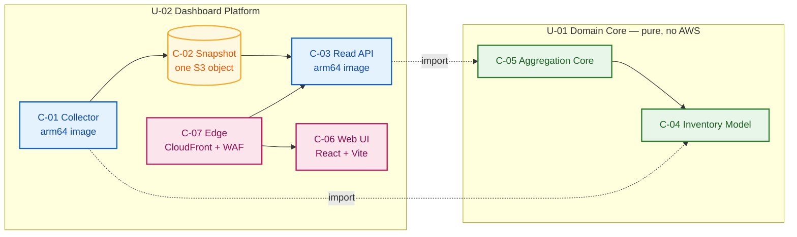
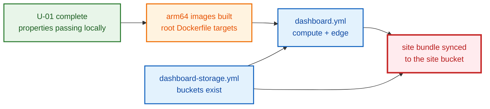

# Unit Dependencies — `dashboard` Blueprint

**Stage**: INCEPTION → Units Generation, Part 2 (artifact 2 of 3)
**Date**: 2026-08-03

---

## Dependency matrix

Rows depend on columns.

| ↓ depends on → | U-01 Domain Core | U-02 Dashboard Platform |
|---|---|---|
| **U-01 Domain Core** | — | **none** |
| **U-02 Dashboard Platform** | **imports** (in-process library call) | — |

**Acyclic — stated, not implied.** U-01's row is empty. There is exactly one edge in the graph, it runs
U-02 → U-01, and a single directed edge between two nodes cannot form a cycle. This is not a fortunate
outcome; it is the property the decomposition was chosen for, and it is checkable: U-01 contains no
reference to any U-02 module, and cannot, because U-01 imports no AWS SDK and U-02 is entirely AWS.

## The one edge, precisely

| Property | Value |
|---|---|
| Direction | U-02 → U-01 |
| Mechanism | Python import, in-process. Not HTTP, not a queue, not a shared database. |
| Surface | C-04's types and four functions; C-05's three functions |
| Who calls what | C-01 uses `normalize_resource`, `build_snapshot`, `serialize_snapshot`. C-03 uses `deserialize_snapshot`, `group_by_tag`, `classify_tag_gaps`, `evaluate_freshness`. |
| Versioning | None needed — same repo, same commit, same container image |
| Failure mode | A type error at import or call time, caught by tests, not a runtime integration failure |

There is no network hop between units, so there is nothing to retry, time out, or circuit-break at this
boundary. That is worth stating because a reader arriving from the vendored rules' microservice framing
will expect an inter-service contract here, and there is none.

---

## Runtime vs. build/deploy-order dependencies

These differ, and conflating them produces the failure that reads as a template bug when it is an
ordering bug. Kept in separate tables deliberately.

### Runtime



Dotted edges are the import. Every solid edge stays inside U-02.

### Build and deploy order



| Ordering constraint | Why | Consequence of inversion |
|---|---|---|
| U-01 before U-02's images | The images contain U-01's code | Import error at container build or cold start |
| Images before `dashboard.yml` | The template pins `ImageUri` by digest | CloudFormation fails on a missing image — **reads as a template bug** |
| `dashboard-storage.yml` before `dashboard.yml` | Compute needs the bucket names as parameters | Missing-parameter or unresolvable-reference failure |
| Buckets before the site sync | `aws s3 sync` needs a destination | **UNRESOLVED — see below** |
| Registry entry ↔ pipeline action | Both directions | Green PR, all stages `Succeeded`, **no stack** |
| Stack name matches `aidlc-<env>-*` | `BuildPipelineRole` scopes CFN to that prefix | Opaque authorization failure, not a naming complaint |

**The red node is the open item.** The pipeline's stage order is fixed —
`Source → PipelineDeploy → Build → BlueprintDeploy → Terraform` — and `PipelineDeploy` deploys only the
pipeline's own stack. So the site bucket does not exist when the Build stage runs, regardless of which
template declares it. Q4 = A does not fix this; my Q4 text wrongly said it would. Options are tabled in
`unit-of-work-plan.md` Part A2 Interaction 1; likely resolution is (b) — Build emits the bundle as a
CodePipeline artifact and a `SiteSync` action runs at `RunOrder: 2` inside `BlueprintDeploy`. **Owner:
U-02, decided at Infrastructure Design.**

---

## Critical path

```
U-01 (core + properties, local)
  → U-02 images (arm64, root Dockerfile targets)
    → dashboard-storage.yml
      → dashboard.yml
        → site sync  ← mechanism unresolved
```

**U-01 is on the critical path and blocks everything.** It is also the only part that needs no AWS, no
account, and no pipeline — so the critical path opens with the cheapest, most locally verifiable work
in the project. That is the practical payoff of Q1 = A, and the reason Q5 = A's depth-first order costs
nothing here: breadth-first would produce the same sequence.

**Nothing blocks U-01.** No answered question, no unresolved item, and no missing tool gates it —
`tools/check` needing `uv` and `terraform` blocks U-02's Build and Test, not U-01's property tests.

**Slack**: none worth exploiting. With two units and one edge there is no second track to run in
parallel, which Q6 = C would have needed. That is a consequence of the graph, not of headcount.

---

## What has no dependency on this blueprint

Nothing in the repo depends on either unit (RESILIENCY-01: blast radius is inward). The blueprint
consumes the Resource Groups Tagging API and the pipeline; nothing consumes it.

Two **shared files** are edited rather than depended upon, and they are the only place U-02's work can
break something outside itself:

| File | Edit | Risk to others |
|---|---|---|
| `pipeline/pipeline.yml` | Add a Build action and BlueprintDeploy action(s) | Pipeline-wide. A malformed action can fail the stage for every blueprint, including `hello-world` and `builder-mcp`. |
| `pipeline/stacks.yml` | Add entries | Low — `validate_stacks.py` enforces both directions |
| root `Dockerfile` | Add two targets | Low — targets are independent; `docker build --target` selects one |

`CLAUDE.md` permits changing the pipeline's shape for a blueprint that needs it, while forbidding
"improvements" to the source stage, artifact handling, role assumptions, and the digest export. Only
additive changes are in scope, and the digest export is the mechanism U-02 depends on rather than one it
should touch.
