# Execution Plan — `teams-bot` Blueprint

**Generated**: 2026-08-04
**Stage**: INCEPTION - Workflow Planning
**Project type**: Brownfield
**Depth**: Comprehensive

---

## Detailed Analysis Summary

### Transformation Scope

- **Transformation Type**: **Architectural transformation plus infrastructure change.** Not a single
  component change.
- **Deployment model change**: from **no deployed compute at all** to **container-image Lambda plus a Bedrock
  AgentCore Runtime**. The repository has never deployed a compute resource; every existing stack is storage,
  IAM or pipeline plumbing.
- **Primary changes**:
  1. A new blueprint at `blueprints/teams-bot/` — CloudFormation template, container, agent code
  2. `pipeline/pipeline.yml` gains a **Build stage** and its container build project moves **x86_64 → ARM64**
  3. `pipeline/codebuild.yml` is **executed for the first time**
  4. `pipeline/stacks.yml` gains a registration entry
- **Related components requiring updates**: `pipeline/pipeline.yml` (major), `pipeline/stacks.yml`
  (configuration), `pipeline/codebuild.yml` (no edit, but first execution), `blueprints/teams-bot/**` (new)
- **Not affected**: `bootstrap/`, `tools/`, `.github/workflows/`, `blueprints/hello-world/`, `aidlc-rules/`

### Change Impact Assessment

| Area | Impact | Detail |
| --- | --- | --- |
| **User-facing changes** | **Yes** | A Teams chatbot that campus users converse with. First user-facing artifact this repository has produced. |
| **Structural changes** | **Yes — substantial** | First public HTTPS ingress, first deployed compute, first container image, first runtime secret read, first outbound third-party dependency, first non-AWS identity chain. |
| **Data model changes** | **Yes — minor** | Conversation state in AgentCore Memory. No relational schema, no migration. |
| **API changes** | **Yes** | A new public HTTPS endpoint. Reverse engineering recorded "REST APIs: None" — this changes that, and the contract is externally defined by Bot Framework rather than by us. |
| **NFR impact** | **Yes** | Security Baseline extension active: public endpoint, JWT validation, least-privilege IAM, 90-day log retention, dependency pinning via `uv.lock`, reserved concurrency. |

### Application Layer Impact

- **Code changes**: entirely new — request handler, JWT validation module, delivery layer, agent runtime
  wrapper (FastAPI + uvicorn)
- **Dependencies**: first runtime dependencies in the repository. Requires a **committed `uv.lock`**
- **Configuration**: stack parameters plus environment variables; gateway key and Entra secret from Secrets
  Manager
- **Testing**: no test framework exists. A negative test for the `serviceurl` check is mandatory (FR-8a)

### Infrastructure Layer Impact

- **Deployment model**: none → Lambda (container image) + AgentCore Runtime + RuntimeEndpoint + Memory
- **Networking**: **no VPC.** Public egress. Confirmed the gateway is public and in AWS `us-east-1`
- **Storage**: AgentCore Memory only; no bucket, no database created by this blueprint
- **Scaling**: reserved concurrency as a blast-radius control (SECURITY-11); AgentCore scales itself

### Operations Layer Impact

- **Monitoring**: CloudWatch log groups with ≥90-day retention; AgentCore Observability via
  `opentelemetry-instrument`
- **Logging**: structured, with correlation ID; every inbound request logged as the SECURITY-02 compensating
  control; no message bodies by default
- **Alerting**: on repeated JWT validation failures
- **Deployment**: pipeline gains a stage — see the ordering hazard in *Module Update Strategy*

### Component Relationships

- **Primary Component**: `blueprints/teams-bot/` (new)
- **Infrastructure Components**: `pipeline/pipeline.yml`, `pipeline/codebuild.yml`
- **Shared Components**: `pipeline/stacks.yml` (registry), the four `cornell:*` tag convention
- **Dependent Components**: none — blueprints are leaves; nothing consumes this one yet
- **Supporting Components**: `tools/check`, `.github/workflows/pr-checks.yml` (unchanged, but gate the PR)

| Related component | Change type | Change reason | Priority |
| --- | --- | --- | --- |
| `pipeline/pipeline.yml` | **Major** | New Build stage; ARM64 compute; new blueprint action | **Critical** |
| `pipeline/stacks.yml` | Configuration | Registry entry; `validate_stacks.py` fails without it | **Critical** |
| `pipeline/codebuild.yml` | None (first execution) | Unproven contract exercised for the first time | **Critical** |
| `blueprints/teams-bot/**` | **Major** (new) | The deliverable | **Critical** |
| External: Entra app, Azure Bot Service, Teams manifest | **Major** (new, manual) | Non-AWS identity chain; manual runbook for v1 | **Critical** |

### Risk Assessment

- **Risk Level**: **High**
- **Rollback Complexity**: **Moderate to Difficult**
- **Testing Complexity**: **Complex**

**Why High rather than Medium:**

1. ~~**The container build path has never executed.**~~ **RETIRED 2026-08-04** — upstream wired the
   ARM64 `Build` stage and two components build through it. The `CONTAINER_TARGET`/`DATE_TAG` in,
   `CONTAINER_DIGEST` out contract is now proven by working examples. **This was the biggest reason
   for the HIGH rating; re-assess.** See `aidlc-docs/inception/upstream-reconciliation-2026-08-04.md`.
2. **The pipeline self-deploys and its recovery path is undocumented.** A merge that breaks
   `pipeline.yml` can leave the pipeline unable to deploy the fix.
3. **`main` deploys to a shared account** used by every workshop team, so a bad merge affects others.
4. **Multiple teams merging into one repository in parallel**, with `pipeline.yml` the highest-contention
   file.
5. **Nearly everything is a first**, so there is no known-good local precedent to copy for the hard parts.

**Why not Critical**: it is a development environment with no production users, the blueprint is a leaf that
nothing depends on, and Marty reviews every PR.

**Rollback**: reverting the blueprint is a clean `git revert` plus stack deletion. Reverting the
`pipeline.yml` change is the moderate-to-difficult part, because of point 2 above.

---

## Workflow Visualization

```mermaid
flowchart TD
    Start(["User Request"])

    subgraph INCEPTION["🔵 INCEPTION PHASE"]
        WD["Workspace Detection<br/><b>COMPLETED</b>"]
        RE["Reverse Engineering<br/><b>COMPLETED</b>"]
        RA["Requirements Analysis<br/><b>COMPLETED</b>"]
        US["User Stories<br/><b>SKIP</b>"]
        WP["Workflow Planning<br/><b>COMPLETED</b>"]
        AD["Application Design<br/><b>EXECUTE</b>"]
        UG["Units Generation<br/>(Planning + Generation)<br/><b>EXECUTE</b>"]
    end

    subgraph CONSTRUCTION["🟢 CONSTRUCTION PHASE"]
        FD["Functional Design<br/><b>EXECUTE</b>"]
        NFRA["NFR Requirements<br/><b>EXECUTE</b>"]
        NFRD["NFR Design<br/><b>EXECUTE</b>"]
        ID["Infrastructure Design<br/><b>EXECUTE</b>"]
        CG["Code Generation<br/>(Planning + Generation)<br/><b>EXECUTE</b>"]
        BT["Build and Test<br/><b>EXECUTE</b>"]
    end

    subgraph OPERATIONS["🟡 OPERATIONS PHASE"]
        OPS["Operations<br/><b>PLACEHOLDER</b>"]
    end

    Start --> WD
    WD --> RE
    RE --> RA
    RA --> US
    US --> WP
    WP --> AD
    AD --> UG
    UG --> FD
    FD --> NFRA
    NFRA --> NFRD
    NFRD --> ID
    ID --> CG
    CG --> BT
    BT --> OPS
    OPS --> End(["Complete"])

    style WD fill:#4CAF50,stroke:#1B5E20,stroke-width:3px,color:#fff
    style RE fill:#4CAF50,stroke:#1B5E20,stroke-width:3px,color:#fff
    style RA fill:#4CAF50,stroke:#1B5E20,stroke-width:3px,color:#fff
    style WP fill:#4CAF50,stroke:#1B5E20,stroke-width:3px,color:#fff
    style CG fill:#4CAF50,stroke:#1B5E20,stroke-width:3px,color:#fff
    style BT fill:#4CAF50,stroke:#1B5E20,stroke-width:3px,color:#fff
    style US fill:#BDBDBD,stroke:#424242,stroke-width:2px,stroke-dasharray: 5 5,color:#000
    style AD fill:#FFA726,stroke:#E65100,stroke-width:3px,stroke-dasharray: 5 5,color:#000
    style UG fill:#FFA726,stroke:#E65100,stroke-width:3px,stroke-dasharray: 5 5,color:#000
    style FD fill:#FFA726,stroke:#E65100,stroke-width:3px,stroke-dasharray: 5 5,color:#000
    style NFRA fill:#FFA726,stroke:#E65100,stroke-width:3px,stroke-dasharray: 5 5,color:#000
    style NFRD fill:#FFA726,stroke:#E65100,stroke-width:3px,stroke-dasharray: 5 5,color:#000
    style ID fill:#FFA726,stroke:#E65100,stroke-width:3px,stroke-dasharray: 5 5,color:#000
    style OPS fill:#FFF59D,stroke:#F57F17,stroke-width:2px,color:#000
    style Start fill:#CE93D8,stroke:#6A1B9A,stroke-width:3px,color:#000
    style End fill:#CE93D8,stroke:#6A1B9A,stroke-width:3px,color:#000

    linkStyle default stroke:#333,stroke-width:2px
```

**Text alternative.** Work flows from the user request through three phases. **INCEPTION**: Workspace
Detection, Reverse Engineering, Requirements Analysis and Workflow Planning are **completed**; User Stories
is **skipped**; Application Design and Units Generation will **execute**. **CONSTRUCTION**: Functional
Design, NFR Requirements, NFR Design, Infrastructure Design, Code Generation and Build and Test all
**execute**. **OPERATIONS** is a placeholder for future deployment and monitoring workflows. The sequence is
strictly linear: each stage feeds the next.

---

## Phases to Execute

### 🔵 INCEPTION PHASE

- [x] Workspace Detection (COMPLETED)
- [x] Reverse Engineering (COMPLETED)
- [x] Requirements Analysis (COMPLETED)
- [x] User Stories (SKIPPED)
  - **Rationale**: The deliverable is a parameterised infrastructure template, not a user-facing feature
    set. Its "users" are builders supplying parameters, and the end-user experience is determined by a
    deployment-time system prompt rather than by this blueprint. There is a single persona and no acceptance
    criteria that requirements do not already capture. Matches the rule's "infrastructure changes" skip
    criterion.
- [x] Workflow Planning (COMPLETED — this document)
- [ ] **Application Design — EXECUTE**
  - **Rationale**: All four execute criteria are met. New components are needed (handler, JWT validation
    module, delivery layer, agent wrapper); business rules need definition (the validation ruleset, the
    streaming state machine, activity-type dispatch); a service layer boundary is required between the
    Lambda front door and AgentCore; and component dependencies need clarification — particularly the
    delivery seam that FR-16 mandates.
- [ ] **Units Generation — EXECUTE**
  - **Rationale**: New endpoints, complex logic (cumulative streaming with sequence numbering and rate
    limiting), state management, changes across two packages, and infrastructure-as-code updates — five of
    six criteria. This stage also produces the AI-DLC **Units of Work** the workshop is teaching, so it has
    pedagogical as well as practical value.

### 🟢 CONSTRUCTION PHASE

- [ ] **Functional Design — EXECUTE**
  - **Rationale**: The bot's externally-defined behaviour (Bot Framework contract, streaming protocol,
    activity handling) needs specifying before code. Much is already captured in
    `prototype-reference-implementation.md` and `response-delivery-and-timeouts.md`, so detail will be lean
    and reference those rather than restate them.
- [ ] **NFR Requirements — EXECUTE**
  - **Rationale**: The Security Baseline extension is active and mandates enforcement at every stage.
    Three SECURITY rules are satisfied only by compensating controls that must be specified concretely
    (request logging, reserved concurrency, application-layer authorisation).
- [ ] **NFR Design — EXECUTE**
  - **Rationale**: Log retention, alerting on validation failures, dependency pinning and vulnerability
    scanning need concrete design. This is also the repository's first observability of any kind.
- [ ] **Infrastructure Design — EXECUTE**
  - **Rationale**: The bulk of the deliverable is CloudFormation. The pipeline change is the highest-risk
    item in the plan and deserves explicit design rather than being improvised.
- [ ] **Code Generation — EXECUTE (ALWAYS)**
  - **Rationale**: Implementation planning and code generation needed.
- [ ] **Build and Test — EXECUTE (ALWAYS)**
  - **Rationale**: Build, test and verification needed. Elevated importance here because the container build
    path has never run.

### 🟡 OPERATIONS PHASE

- [ ] Operations — PLACEHOLDER
  - **Rationale**: Future deployment and monitoring workflows. `observability/` is on the repository's
    deliberately-not-built list.

---

## Module Update Strategy

- **Update Approach**: **Sequential**, single pull request
- **Critical Path**: `pipeline/pipeline.yml` → `blueprints/teams-bot/**`. The Build stage and ARM64 change
  must exist before any image can be produced, and the image must exist before the AgentCore runtime can
  deploy.
- **Coordination Points**: the `CONTAINER_DIGEST` variable passed from the Build stage into the blueprint's
  `ParameterOverrides`; the `stacks.yml` ↔ `pipeline.yml` mirroring that `validate_stacks.py` enforces in
  both directions.
- **Testing Checkpoints**: (1) `tools/check` green locally; (2) a **trivial container** proves the build path
  before the real agent is wired to it; (3) the stack deploys; (4) a real Teams message round-trips.

### Package change sequence

| # | Package | Reason | Can parallelise? |
| --- | --- | --- | --- |
| 1 | `pipeline/pipeline.yml` — ARM64 compute type | Nothing ARM64 can build until this lands | No — blocks everything |
| 2 | `pipeline/pipeline.yml` — Build stage | Produces the image the blueprint consumes | No — depends on 1 |
| 3 | `blueprints/teams-bot/` — Dockerfile + agent | Needs a working build to validate against | Authoring can parallelise; validation cannot |
| 4 | `blueprints/teams-bot/infra/teams-bot.yml` | Consumes `CONTAINER_DIGEST` from 2 | Authoring can parallelise |
| 5 | `pipeline/stacks.yml` + blueprint action | Must mirror; `validate_stacks.py` fails otherwise | No — must accompany 4 |

### ⚠ Deployment ordering hazard — expected, and worth knowing before it happens

A CodePipeline execution runs with the pipeline structure that was in place when the execution **started**.
`PipelineDeploy` updates the structure *within* a run, but the run already in flight continues with the old
stage list.

**Expected consequence of the first merge**: the triggered run uses the **old** structure, which has neither
the Build stage nor the `teams-bot` action. It will update the pipeline definition and deploy `hello-world`
as usual — and **will not deploy `teams-bot`**. All stages report `Succeeded`. Nothing is broken.

**This is the repository's documented silent-failure shape** — green pipeline, no stack — so it will look
alarming and be benign.

**Mitigation**: after the merge completes, **start a second pipeline execution manually** (a release change,
no code change). The second run uses the new structure and deploys properly. Flagged as behaviour to
**confirm on the first merge** rather than asserted with certainty.

### Rollback strategy

| Failure point | Recovery |
| --- | --- |
| `tools/check` fails | Local; no impact |
| Container build fails | Build stage fails, `BlueprintDeploy` never runs, no stack changes |
| Blueprint stack fails | CloudFormation rolls back automatically; other stacks untouched |
| Blueprint deploys but the bot misbehaves | `git revert` the blueprint, delete the stack. Clean — it is a leaf |
| **`pipeline.yml` change breaks the pipeline** | **The difficult case.** Requires deploying `pipeline/pipeline.yml` by hand with the AWS CLI, out of band. Someone should know this procedure **before** merging |

---

## Estimated Timeline

- **Total stages remaining**: **8** (2 INCEPTION, 6 CONSTRUCTION)
- **Estimated duration**: within the two-day workshop, given that detail is adaptive and a large amount of
  design is already captured in the Requirements Analysis artifacts.

**Honest note on sequencing under a timebox.** Application Design and Units Generation are what unblock code
generation and should come first. The Construction design stages will lean heavily on existing artifacts —
`agentcore-mandate-and-critical-path.md` already carries the six-step critical path down to file and line
numbers, and `prototype-reference-implementation.md` carries nine concrete behavioural requirements — so
those stages consolidate rather than rediscover. If time pressure bites, the highest-value order is
**Application Design → Units Generation → Code Generation → Build and Test**, treating the three
design stages in between as lean consolidations.

---

## Success Criteria

**Primary Goal**: a reusable `teams-bot` blueprint, deployed to `aidlc-main-teams-bot` through the governed
pipeline, that holds a streaming conversation in Microsoft Teams with all model traffic routed through
Cornell's LiteLLM gateway.

**Key Deliverables**:

1. `blueprints/teams-bot/infra/teams-bot.yml` — Lambda function URL, AgentCore Runtime, RuntimeEndpoint,
   Memory, IAM, all four `cornell:*` tags
2. `blueprints/teams-bot/` — Dockerfile (ARM64, port 8080, `/ping` + `/invocations`), agent code, `uv.lock`
3. `pipeline/pipeline.yml` — ARM64 build environment, Build stage, blueprint deploy action
4. `pipeline/stacks.yml` — registration entry
5. A runbook for the manual Microsoft-side provisioning
6. A negative test proving a mismatched `serviceurl` claim is rejected

**Quality Gates**:

- `tools/check` passes — `cfn-lint` clean and the registry reconciled in both directions
- No credential in any file
- All four `cornell:*` tags on every resource
- No wildcard IAM actions or resources without a documented exception
- `uv.lock` committed; no `latest` or unpinned base image tag
- Image referenced by digest, never by tag
- Log retention ≥ 90 days
- Marty's review approval — nobody may approve their own PR

**Integration Testing**: a real Teams message produces a streamed reply, and `conversationUpdate` produces a
greeting without the bot greeting itself.

**Operational Readiness**: structured logs with correlation IDs reaching CloudWatch, AgentCore Observability
traces present, and an alarm on repeated JWT validation failures.

---

## Open Dependencies Carried Into Construction

| # | Item | Owner | Blocks |
| --- | --- | --- | --- |
| D-2 | A gateway **service key** for the bot, not a person's | Gateway operator | Deployment, not design |
| D-3 | **Tagging guidance document** | The user | Q19 remains deferred; four tags stand meanwhile |
| D-4 | `KnowledgeBaseId` and timeline | Knowledge Base team | Tier B only — out of scope for v1 |
| D-5 | Does another team also need the Build stage? | Marty | Merge-conflict risk |
| D-6 | Cost guardrails on the shared account | Dan Klinger | Nothing — advisory |

None blocks starting Application Design.
