# Execution Plan — `dashboard` Blueprint (Cost & Usage Dashboard)

**Stage**: INCEPTION → Workflow Planning (ALWAYS EXECUTE)
**Date**: 2026-08-03
**Inputs**: `inception/requirements/requirements.md` (approved), `inception/user-stories/stories.md`
and `personas.md` (approved 2026-08-03), `inception/plans/user-stories-assessment.md`,
`inception/plans/story-generation-plan.md`, `inception/requirements/requirement-amendment-questions-telemetry.md`

---

## Detailed Analysis Summary

### Transformation scope
The repo is brownfield; the unit of work is a new, self-contained blueprint directory. So this is
**not** an architectural transformation of existing components — it is an **addition** that must
integrate with two existing, known-good mechanisms: the stack registry (`pipeline/stacks.yml`) and
the deploy path (`pipeline/pipeline.yml`).

- **Transformation type**: Addition of a new component, plus a **minor, additive change to the
  pipeline** (see the container-build finding below)
- **Primary changes**: new `blueprints/dashboard/` — collector, snapshot store, read API, static
  site, edge access control; the stray `hello-world.yml` copy repurposed as this blueprint's
  deployment marker (FR-6)
- **Related components**: `pipeline/stacks.yml` (registration), `pipeline/pipeline.yml`
  (BlueprintDeploy action + Build stage action), `pipeline/codebuild.yml` (already defined,
  invoked for the first time), `tools/check` (validation must stay green)
- **Explicitly not touched**: `bootstrap/account-bootstrap.yml`, `blueprints/hello-world/`

### Change impact assessment

| Impact area | Yes/No | Detail |
|---|---|---|
| **User-facing changes** | **Yes** | A new browser-reachable UI and JSON endpoint where none existed. One persona (`P-01`), admitted by network position. |
| **Structural changes** | **Yes, additive** | First blueprint with compute, first with an internet-facing edge, first to need a container image. Does not restructure anything existing. |
| **Data model changes** | **Yes** | A new snapshot schema (inventory + collection timestamp), required by FR-2.4 to be extensible to metrics defined later. No existing schema is modified. |
| **API changes** | **Yes, new only** | A new read API (FR-3). No existing contract changes. |
| **NFR impact** | **Yes, substantial** | Three opted-in extensions contribute 40 blocking rules (SECURITY-01..15, PBT-01..10, RESILIENCY-01..15). This is the largest single driver of downstream stage selection. |

### Layer impact

- **Application**: two new entry points (scheduled collector, request-serving API), Python with
  Hypothesis for property-based tests, no existing code modified.
- **Infrastructure**: all new. Serverless, `us-east-1`, Lambda as **container images**. No VPC,
  subnet, VPN, Direct Connect, or Transit Gateway (FR-5.4 prohibits them). Edge access control by
  deny-by-default IP allowlist.
- **Operations**: new alarms (US-13), metrics and a health dashboard (US-14), access logging
  (US-11), structured application logging (US-12). Note this is *this blueprint's* observability,
  not the platform-wide `observability/` component, which remains unbuilt.

### Component relationships

- **Primary component**: `blueprints/dashboard/`
- **Infrastructure components**: `pipeline/pipeline.yml`, `pipeline/codebuild.yml`
- **Shared components**: `pipeline/stacks.yml` (registry), `pipeline/validate_stacks.py` (enforces
  it), `tools/check`
- **Dependent components**: none — nothing calls this blueprint
- **Supporting components**: the four `cornell:*` tags, which this blueprint both *consumes* (as its
  data source) and *must carry* (as a deployed stack). It is the first component to depend on the
  tagging convention being correct rather than merely present.

| Related component | Change type | Reason | Priority |
|---|---|---|---|
| `pipeline/stacks.yml` | Minor | Register the new template | **Critical** — unregistered templates fail validation |
| `pipeline/pipeline.yml` — BlueprintDeploy action | Minor | Registry entry needs a matching action | **Critical** — its absence deploys nothing while reporting success |
| `pipeline/pipeline.yml` — Build stage action | Minor, additive | Lambda means container images; no stage invokes `ContainerBuildProject` yet | **Critical** — see finding below |
| `pipeline/codebuild.yml` | Configuration-only | Already defined and known-good; invoked for the first time | Important |
| `tools/check` | None | Must pass unchanged | **Critical** |

### Risk assessment

- **Risk level**: **Medium** — not Low, and the reasons are specific rather than generic:
  1. **Every merge to `main` deploys to a shared AWS account**, and the workshop is running
     **Aug 3–4, 2026 — now**. A broken merge is felt by other people immediately.
  2. **The silent-failure mode is live here.** A registry entry without a matching pipeline action
     produces a green PR, all stages `Succeeded`, and no stack. `validate_stacks.py` catches it in
     both directions, which is why this is Medium and not High.
  3. **Deny-by-default access control can lock out legitimate viewers.** `personas.md` already
     records that a Cornell user on home ISP, conference wifi, or cellular is excluded. During a
     workshop, that is a plausible way for the dashboard to look broken while working exactly as
     specified. US-11's requirement that blocks be visible in logs is the mitigation.
  4. **This blueprint is the first to need a container image** (see below), so it must wire a
     pipeline stage that has never run.
- **Rollback complexity**: **Easy-to-Moderate.** The blueprint is a self-contained stack — deleting
  it removes it. The pipeline change is additive and revertable. The one asymmetry: the Build stage
  action and the ECR repository are shared infrastructure once introduced, so reverting them later
  affects anything else that has come to depend on them.
- **Testing complexity**: **Moderate-to-Complex.** PBT is enabled at **full** enforcement, and
  PBT's requirement that aggregation be testable without network access to AWS constrains the
  design — the collection boundary has to be separable from the aggregation logic. That is a design
  constraint arriving from the test strategy, which is why Functional Design executes before code.

---

## Finding: the container build stage does not exist yet

This was not visible from the requirements or the stories, and it is worth stating plainly before
approval rather than discovering it during Construction.

`CLAUDE.md` requires that **Lambda means container images**, and this blueprint needs two functions.
`pipeline/pipeline.yml` defines `ContainerRepository` (line 103) and `ContainerBuildProject`
(line 191), and `pipeline/codebuild.yml` is known-good — but the pipeline has exactly three stages:
`Source`, `PipelineDeploy`, `BlueprintDeploy`, whose only action is `HelloWorldCloudFormation`.
**No stage invokes `ContainerBuildProject`.** `pipeline/README.md` and `CLAUDE.md` both anticipate
this: "no stage invokes them yet because nothing needs an image. Wiring one is a Build stage action
plus a Dockerfile."

Two consequences:

1. **This is a coverage gap in the approved stories.** US-15 covers registry registration, the
   matching BlueprintDeploy action, stack naming, explicit parameters, tags, and `tools/check` — it
   does **not** cover adding the Build stage action or the Dockerfiles. The gap is recorded here
   rather than silently absorbed. It is small and additive, and it belongs to Infrastructure Design
   and Code Generation, so **no story amendment is proposed** — but if you would rather it be
   explicit in `stories.md`, that is a change to request at this gate.
2. **It touches `pipeline.yml`, which is known-good.** `CLAUDE.md` permits changing the pipeline's
   *shape* when a blueprint needs something, while forbidding "improving" the source stage, artifact
   handling, role assumptions, or the digest export. Adding a Build stage action is the former. The
   constraint will be honoured literally: add the action, change nothing else.

---

## Workflow Visualization

```mermaid
flowchart TD
    Start(["User Request: build out the dashboard blueprint"])

    subgraph INCEPTION["🔵 INCEPTION PHASE"]
        WD["Workspace Detection<br/><b>COMPLETED</b>"]
        RE["Reverse Engineering<br/><b>SKIP</b>"]
        RA["Requirements Analysis<br/><b>COMPLETED</b>"]
        US["User Stories<br/><b>COMPLETED</b>"]
        WP["Workflow Planning<br/><b>IN PROGRESS</b>"]
        AD["Application Design<br/><b>EXECUTE</b>"]
        UG["Units Generation<br/>(Planning + Generation)<br/><b>EXECUTE</b>"]
    end

    subgraph CONSTRUCTION["🟢 CONSTRUCTION PHASE"]
        FD["Functional Design<br/><b>EXECUTE</b>"]
        NFRA["NFR Requirements<br/><b>EXECUTE</b>"]
        NFRD["NFR Design<br/><b>EXECUTE</b>"]
        ID["Infrastructure Design<br/><b>EXECUTE</b>"]
        CG["Code Generation<br/>(Planning + Generation)<br/><b>EXECUTE</b>"]
        BT["Build and Test<br/><b>EXECUTE</b>"]
    end

    subgraph OPERATIONS["🟡 OPERATIONS PHASE"]
        OPS["Operations<br/><b>PLACEHOLDER</b>"]
    end

    Start --> WD
    WD --> RE
    RE --> RA
    RA --> US
    US --> WP
    WP --> AD
    AD --> UG
    UG --> FD
    FD --> NFRA
    NFRA --> NFRD
    NFRD --> ID
    ID --> CG
    CG --> BT
    BT --> OPS
    OPS --> End(["Complete"])

    style WD fill:#4CAF50,stroke:#1B5E20,stroke-width:3px,color:#fff
    style RA fill:#4CAF50,stroke:#1B5E20,stroke-width:3px,color:#fff
    style US fill:#4CAF50,stroke:#1B5E20,stroke-width:3px,color:#fff
    style WP fill:#4CAF50,stroke:#1B5E20,stroke-width:3px,color:#fff
    style CG fill:#4CAF50,stroke:#1B5E20,stroke-width:3px,color:#fff
    style BT fill:#4CAF50,stroke:#1B5E20,stroke-width:3px,color:#fff
    style RE fill:#BDBDBD,stroke:#424242,stroke-width:2px,stroke-dasharray: 5 5,color:#000
    style AD fill:#FFA726,stroke:#E65100,stroke-width:3px,stroke-dasharray: 5 5,color:#000
    style UG fill:#FFA726,stroke:#E65100,stroke-width:3px,stroke-dasharray: 5 5,color:#000
    style FD fill:#FFA726,stroke:#E65100,stroke-width:3px,stroke-dasharray: 5 5,color:#000
    style NFRA fill:#FFA726,stroke:#E65100,stroke-width:3px,stroke-dasharray: 5 5,color:#000
    style NFRD fill:#FFA726,stroke:#E65100,stroke-width:3px,stroke-dasharray: 5 5,color:#000
    style ID fill:#FFA726,stroke:#E65100,stroke-width:3px,stroke-dasharray: 5 5,color:#000
    style OPS fill:#FFF59D,stroke:#F57F17,stroke-width:2px,stroke-dasharray: 5 5,color:#000
    style Start fill:#CE93D8,stroke:#6A1B9A,stroke-width:3px,color:#000
    style End fill:#CE93D8,stroke:#6A1B9A,stroke-width:3px,color:#000

    linkStyle default stroke:#333,stroke-width:2px
```

---

## Phases to Execute

### 🔵 INCEPTION PHASE
- [x] Workspace Detection — **COMPLETED**
- [x] Reverse Engineering — **SKIPPED**
  - **Rationale**: `README.md` and `CLAUDE.md` already document the architecture and conventions,
    and the unit of work is a new self-contained blueprint rather than a modification of existing
    components. The only pre-existing artifact under the target path is an unregistered copy-paste
    of `hello-world` with no logic to reverse-engineer. Recorded in `aidlc-state.md`; requestable
    at any time.
- [x] Requirements Analysis — **COMPLETED** (approved 2026-08-03; 5 clarification rounds)
- [x] User Stories — **COMPLETED** (approved 2026-08-03; 8 v1 + 7 enabler + 2 deferred)
- [x] Workflow Planning — **IN PROGRESS** (this document)
- [ ] **Application Design — EXECUTE**
  - **Rationale**: every trigger applies and none of the skip conditions do. New components are
    needed (collector, snapshot store, read API, static site, edge access control); business rules
    need definition that the stories deliberately left open — tag-gap classification including
    empty/whitespace values (US-04), the "missing this tag" group (US-03), staleness thresholds
    (US-05), and the degradation ladder in US-06 (no-data vs. unreadable vs. stale-but-present).
    Component dependencies need clarification because PBT requires the aggregation logic to be
    testable without network access to AWS, which forces a boundary between collection and
    aggregation. Also the stage where SECURITY-01, SECURITY-06 and RESILIENCY-10's timeout/retry
    behaviour land, per the coverage table in `stories.md`.
- [ ] **Units Generation — EXECUTE**
  - **Rationale**: new data model (the snapshot schema, required by FR-2.4 to be extensible to
    metrics defined later — and the telemetry amendment now names what those are, so the schema
    should be shaped with that in view); new API endpoints; aggregation logic; infrastructure-as-code
    updates; and work spanning more than one area (blueprint templates, Lambda source, pipeline
    wiring). None of the skip conditions hold — this is not UI-only, not a configuration update, and
    not a simple logic change.

### 🟢 CONSTRUCTION PHASE
- [ ] **Functional Design — EXECUTE**
  - **Rationale**: required by PBT-01, which identifies testable properties **at Functional Design**
    — `requirements.md` §4.2 carries the candidate list (snapshot round-trip, aggregation count
    invariants, collection idempotence, reference-implementation comparison, tag-completeness
    classification) and this is the stage that turns it into a specification. Skipping it would
    leave a blocking rule with no home.
- [ ] **NFR Requirements — EXECUTE**
  - **Rationale**: 40 blocking rules from three opted-in extensions need to be attached per unit
    rather than left as a document-level list. Performance, security, and observability requirements
    all apply.
- [ ] **NFR Design — EXECUTE**
  - **Rationale**: not optional here — three resiliency decision points were **explicitly deferred
    to this stage** and are recorded as such in `aidlc-state.md`: RESILIENCY-04 (CI/CD tooling,
    rollback mechanism, deployment style), RESILIENCY-14 (resiliency testing approach),
    RESILIENCY-15 (incident response process). These are user decisions the model may not make, so
    this stage will raise questions rather than choose.
- [ ] **Infrastructure Design — EXECUTE**
  - **Rationale**: everything in this repo is IaC, so the infrastructure *is* the deliverable rather
    than a wrapper around it. This is also where the deferred items land: SECURITY-01 (encryption at
    rest), SECURITY-06 (least-privilege IAM, including the documented `tag:GetResources` exception),
    RESILIENCY-08 (multi-zone via managed services), SECURITY-14's SRI, and the container build
    stage identified above.
- [ ] **Code Generation — EXECUTE (ALWAYS)**
  - **Rationale**: implementation planning and code generation needed.
- [ ] **Build and Test — EXECUTE (ALWAYS)**
  - **Rationale**: build, test, and verification needed. `tools/check` is the only sanctioned
    pre-push check and must pass.

### 🟡 OPERATIONS PHASE
- [ ] Operations — **PLACEHOLDER**
  - **Rationale**: future deployment and monitoring workflows. Note the distinction: US-11..US-14
    deliver *this blueprint's* observability; the platform-wide `observability/` component remains
    deliberately unbuilt, and the telemetry amendment records the trigger for creating it.

**Nothing is proposed for skipping beyond Reverse Engineering**, which was already skipped with a
recorded rationale. Every conditional stage has at least one blocking requirement that would
otherwise have no home — that is a consequence of opting into all three extensions, not of
padding the plan.

---

## Change sequence

Sequential, because the dependencies are real rather than organizational:

1. **`blueprints/dashboard/` templates + Lambda sources** — the substance. Nothing else is
   meaningful without it.
2. **Dockerfiles + the pipeline Build stage action** — required before the Lambdas can deploy at
   all, since Lambda means container images.
3. **`pipeline/stacks.yml` registration + matching BlueprintDeploy action** — must land in the
   **same PR** as the template. `validate_stacks.py` enforces both directions, and the pairing is
   what prevents the green-build-deploys-nothing failure.
4. **`tools/check`** — green before push, no exceptions.

**Coordination point**: steps 2 and 3 both edit `pipeline/pipeline.yml`. They should be one edit,
not two, to avoid a half-wired pipeline in an intermediate commit.

**Rollback**: revert the PR. The stack is self-contained; the pipeline changes are additive.

---

## Estimated Timeline

- **Remaining stages**: 6 (Application Design, Units Generation, Functional Design, NFR
  Requirements, NFR Design, Infrastructure Design) plus Code Generation and Build and Test.
- **Duration**: not estimated in wall-clock, deliberately. Each stage gates on your review and
  approval, and two of them (NFR Design's three resiliency decisions, and the deferred cost data
  source if FR-8 is ever taken up) gate on decisions only you can make. A date here would be
  fiction.
- **The constraint that does matter**: the workshop is **Aug 3–4, 2026 — now**. If the dashboard
  needs to be demonstrable during it, say so at this gate: that is a scope decision, and the honest
  lever is which of FR-1..FR-7 ships first, not compressing the stages.

---

## Success Criteria

**Primary goal**: a deployed dashboard that shows what the platform has actually deployed, drawn
from `cornell:*` tags, reachable by a Cornell viewer with no AWS account and no login.

**Key deliverables**
- `blueprints/dashboard/` — collector, snapshot store, read API, static UI, edge access control
- The stray `hello-world.yml` copy repurposed as this blueprint's deployment marker (FR-6)
- Registry entry, BlueprintDeploy action, and Build stage action, all mutually consistent
- Property-based test suite at full PBT enforcement, alongside example-based tests
- Alarms, metrics, access logging, structured application logging

**Quality gates**
- `tools/check` passes
- `validate_stacks.py` passes in both directions — registry↔filesystem and registry↔pipeline actions
- All four `cornell:*` tags on every resource this blueprint creates
- Stack name conforms to `<application>-<environment>-<name>`; every parameter passed explicitly
- No credential, key, or secret in any file — the repo is public and secret scanning is disabled
- `main` reaches deployment only via PR with one human approval, by someone other than the author
- No story's acceptance criteria left unverified, and any that cannot be verified at story level
  named with the stage that carries it

**Integration and operational readiness**
- The stack deploys through the pipeline end to end, not merely by hand
- A blocked request is diagnosable from logs, so a locked-out viewer is distinguishable from an
  outage
- Staleness is visible in the UI and alarmed, so an old snapshot is never mistaken for a current one
