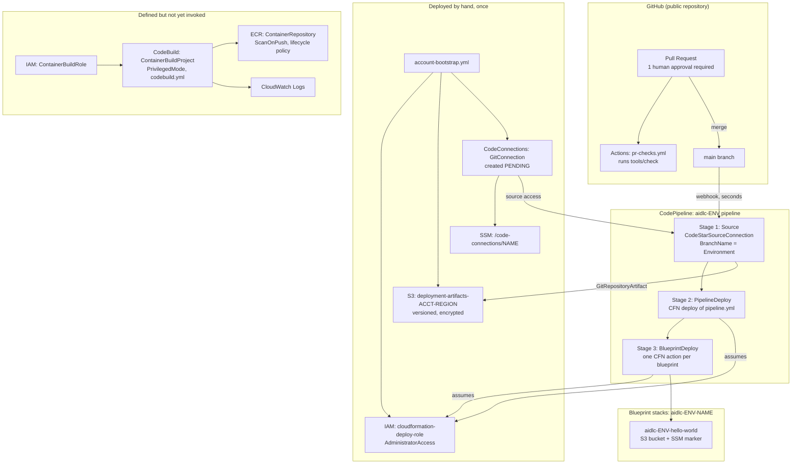
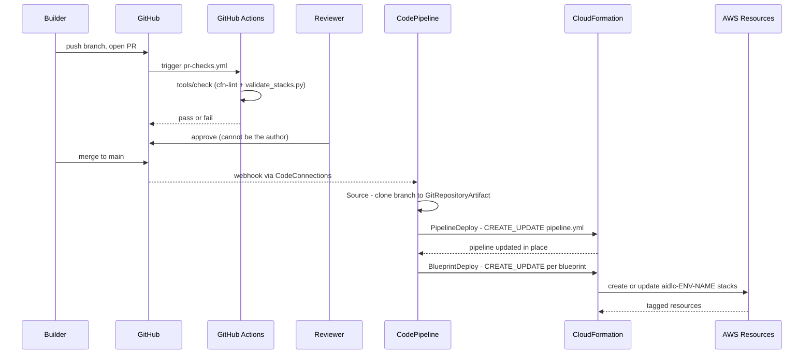
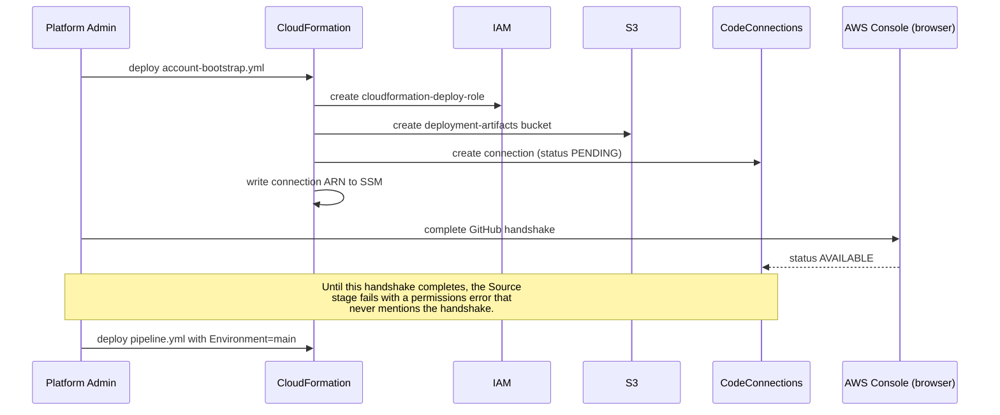

# System Architecture

## System Overview

The system is an infrastructure-as-code monorepo with **no runtime application code of its
own**. Its behaviour is entirely the behaviour of an AWS CodePipeline defined in
CloudFormation, plus a small Python validator that runs pre-merge.

Three layers, deployed in dependency order:

1. **Bootstrap** (`bootstrap/account-bootstrap.yml`) — deployed by hand, once per AWS
   account, by an administrator. Creates the deployment role, artifact bucket, and GitHub
   connection that everything above depends on.
2. **Pipeline** (`pipeline/pipeline.yml`) — deployed by hand once, then self-updating. Three
   stages: `Source`, `PipelineDeploy`, `BlueprintDeploy`.
3. **Blueprints** (`blueprints/<name>/infra/<name>.yml`) — deployed by the pipeline, one
   CloudFormation action per blueprint.

The pipeline's defining property is that it **deploys itself before it deploys anything
else**. `PipelineDeploy` runs ahead of `BlueprintDeploy` in the same execution, so a merge
that changes both the pipeline and a blueprint applies the new pipeline shape first. This
means a pipeline change ships through the same reviewed, automated path as any other change
— there is no privileged side channel.

The second defining property is that **`Environment` is the branch name**. The `Source`
stage tracks `BranchName: !Ref Environment`, so deploying the pipeline template with
`Environment=main` produces the pipeline that reacts to merges into `main`. Deploying it
again with `Environment=test` produces a wholly independent pipeline tracking a `test`
branch and owning its own `aidlc-test-*` stacks. That is the mechanism for parallel
environments, and it is why the parameter is constrained so tightly: `Environment` appears
inside every stack name and inside the IAM resource prefix
`stack/${Application}-${Environment}*` that scopes the pipeline's CloudFormation
permissions.

## Architecture Diagram

**Text alternative**: A pull request against the public GitHub repository runs
`tools/check` via GitHub Actions and needs one human approval. Merging to `main` fires a
webhook into CodePipeline. Separately and beforehand, an administrator deploys
`account-bootstrap.yml` by hand, creating an administrator-level CloudFormation deploy role,
a versioned artifact bucket, and a GitHub CodeConnections connection whose ARN is published
to SSM. The pipeline has three sequential stages: Source (tracking the branch named by the
`Environment` parameter, via the connection), PipelineDeploy (redeploying the pipeline
template itself), and BlueprintDeploy (one CloudFormation action per registered blueprint).
Both deploy stages assume the bootstrap deploy role and write artifacts to the bootstrap
bucket. A container build capability — ECR repository, privileged CodeBuild project, its
role and log group — is fully defined but no stage invokes it. The only blueprint stack
today is `aidlc-<env>-hello-world`, containing an S3 bucket and an SSM deployment marker.

## Component Descriptions

### `bootstrap/account-bootstrap.yml`

- **Purpose**: One-time, manually deployed account foundation.
- **Responsibilities**: Create `cloudformation-deploy-role` (trusted by CodePipeline and
  CloudFormation, holding `AdministratorAccess`); create the versioned, SSE-encrypted
  `deployment-artifacts-${AWS::AccountId}-${AWS::Region}` bucket with public access blocked;
  create the CodeConnections connection to GitHub; publish the connection ARN to
  `/code-connections/${GitConnectionName}`.
- **Dependencies**: None in-repo. Requires an administrator with console/CLI access and a
  human browser handshake to activate the connection.
- **Type**: Infrastructure (manual).

### `pipeline/pipeline.yml`

- **Purpose**: The deploy path. Defines the pipeline, its roles, and the container build
  capability.
- **Responsibilities**: Source from the tracked branch; self-deploy; deploy each blueprint
  with every parameter passed explicitly; expose the container build project for future use.
  Declares `BuildPipelineRole`, whose CloudFormation permissions are scoped to
  `arn:...:stack/${Application}-${Environment}*` — the constraint that makes the stack
  naming convention load-bearing rather than cosmetic.
- **Dependencies**: `account-bootstrap.yml` (deploy role by name, artifact bucket,
  connection); `pipeline/codebuild.yml` as the container buildspec;
  `blueprints/*/infra/*.yml` as deploy targets.
- **Type**: Infrastructure.

### `pipeline/codebuild.yml`

- **Purpose**: Buildspec for container image builds.
- **Responsibilities**: Log in to ECR, build and push an image, export `CONTAINER_DIGEST` for
  a downstream stage to consume. Requires `CONTAINER_TARGET` and `DATE_TAG` from the
  invoking stage.
- **Dependencies**: `ContainerBuildProject` and `ContainerRepository` in `pipeline.yml`.
- **Type**: Infrastructure (build definition). **Not currently invoked by any stage.**

### `pipeline/stacks.yml`

- **Purpose**: The registry of every CloudFormation template in the repository and how each
  is deployed.
- **Responsibilities**: Single source of truth for the reconciliation the validator performs.
  Three entries today: `account-bootstrap` (`manual`), `pipeline` (`pipeline`),
  `hello-world` (`pipeline`).
- **Dependencies**: Consumed by `validate_stacks.py`.
- **Type**: Configuration.

### `pipeline/validate_stacks.py`

- **Purpose**: Pre-merge consistency check across registry, filesystem and pipeline
  definition.
- **Responsibilities**: Discover every `.yml`/`.yaml` containing `AWSTemplateFormatVersion`;
  fail on an unregistered template and on a registered template that does not exist; extract
  `GitRepositoryArtifact::<path>` references from `pipeline.yml` and fail in **both**
  directions — a `deployed_by: pipeline` entry with no action, and an action with no entry.
  The first of those catches the failure mode where a blueprint registers cleanly, the PR is
  green, every stage reports `Succeeded`, and no stack is ever created.
- **Dependencies**: `pyyaml`, declared in PEP 723 inline metadata; resolved by `uv`.
- **Type**: Test / validation tooling.

### `blueprints/hello-world/infra/hello-world.yml`

- **Purpose**: The reference blueprint. Proves the path; does nothing useful.
- **Responsibilities**: Demonstrate the required blueprint shape — parameters
  (`Application`, `Environment`, `Owner`, `BlueprintVersion`, `SourceCommitId`), the four
  `cornell:*` tags, the stack naming convention, and an independently versioned blueprint.
  Records the deployed commit in an SSM parameter.
- **Dependencies**: Deployed by the `BlueprintDeploy` stage; registered in `stacks.yml`.
- **Type**: Application blueprint (infrastructure only).

### `tools/check`

- **Purpose**: The single pre-push and CI command.
- **Responsibilities**: Run `cfn-lint` across all templates and then `validate_stacks.py`,
  both through `uv` so a clean machine needs nothing but `uv`. Interposes the mandatory
  literal `--` before template paths, because `cfn-lint --region` takes `nargs='+'` and
  would otherwise swallow the paths as region names, lint nothing, and exit 0.
- **Dependencies**: `uv`.
- **Type**: Test / tooling.

### `.github/workflows/pr-checks.yml`

- **Purpose**: Run the same gate on every pull request.
- **Responsibilities**: Install `uv`, run `tools/check`. Constrained by an org
  allowed-actions policy that permits only github-owned actions plus
  `hashicorp/setup-terraform@*`; any other `uses:` fails the whole run as
  `startup_failure` with no job logs.
- **Dependencies**: `tools/check`.
- **Type**: CI.

### `aidlc-rules/`

- **Purpose**: Verbatim vendored copy of the AI-DLC methodology from
  `awslabs/aidlc-workflows`.
- **Responsibilities**: None at runtime. Inert documentation, loaded into an AI session only
  on explicit invocation. Must stay byte-identical to upstream; the re-sync is a
  delete-and-replace that would silently discard local edits.
- **Dependencies**: None.
- **Type**: Vendored documentation.

## Data Flow

### Merge to deployment

**Text alternative**: A builder pushes a branch and opens a pull request. GitHub Actions
runs `tools/check`. A reviewer other than the author approves. On merge, a CodeConnections
webhook starts the pipeline within seconds. Source clones the branch into
`GitRepositoryArtifact`. PipelineDeploy applies `pipeline.yml` to the pipeline itself.
BlueprintDeploy then runs one CloudFormation `CREATE_UPDATE` per blueprint, creating or
updating `aidlc-<env>-<name>` stacks whose resources carry the four `cornell:*` tags.

### Account bootstrap (one time, by hand)

**Text alternative**: An administrator deploys `account-bootstrap.yml`, which creates the
deploy role, the artifact bucket, and a CodeConnections connection in `PENDING` state, and
publishes the connection ARN to SSM. The administrator must then complete a GitHub
authorization handshake in a browser to move the connection to `AVAILABLE`. Skipping this
produces a Source-stage permissions error that never mentions the handshake. Only then is
`pipeline.yml` deployed with `Environment=main`.

## Integration Points

- **External APIs**:
  - **GitHub**, via AWS CodeConnections — the source of every deployment. Read-only from
    AWS's side. Connection is per-account and cannot be shared across accounts.
  - **GitHub Actions** — runs the pre-merge gate. Constrained by the org allowed-actions
    policy.
  - **Amazon ECR** — target for container images once a blueprint needs one.

- **Databases**: None. No database of any kind is deployed. The only persistent state is an
  S3 bucket and an SSM parameter in the `hello-world` blueprint, plus the CloudFormation
  stack state itself.

- **Third-party Services**: None at runtime. `uv` and PyPI (`cfn-lint`, `pyyaml`) are
  build-time only.

## Infrastructure Components

- **CloudFormation stacks** (this repository uses CloudFormation, not CDK):

  | Stack | Template | Deployed by | Purpose |
  | --- | --- | --- | --- |
  | account bootstrap | `bootstrap/account-bootstrap.yml` | manual | Deploy role, artifact bucket, GitHub connection |
  | pipeline | `pipeline/pipeline.yml` | pipeline (self) | The deploy path, its roles, and the container build capability |
  | `aidlc-<env>-hello-world` | `blueprints/hello-world/infra/hello-world.yml` | pipeline | Reference blueprint |

- **Deployment Model**: Push-based, branch-tracking, self-updating. `main` is PR-only with
  one required human approval; nobody can approve their own pull request, so every change
  needs a second person. `Environment` equals the branch name, so a merge to a tracked
  branch is a deployment to that environment. Blueprint stacks are named
  `<application>-<environment>-<name>` because `BuildPipelineRole` scopes CloudFormation
  permissions to `stack/${Application}-${Environment}*`; a stack named outside the
  convention cannot be deployed and fails with an opaque authorization error rather than a
  naming complaint. Region is `us-east-1`; the intent is serverless-first, with Lambda
  meaning container images.

- **Networking**: No VPC, no subnets, no security groups. Nothing deployed requires
  network isolation yet. Every component is a regional AWS service accessed over public
  endpoints with IAM authorization. **This is a live gap for a Teams chatbot**, which needs
  a publicly reachable HTTPS messaging endpoint — no such ingress exists in the repository
  today.

## Architectural Observations Relevant to the Teams Chatbot

Recorded here because they constrain the design stages that follow, not as criticism.

1. **No compute has ever been deployed.** Every stack to date is storage, IAM, or pipeline
   plumbing. A Teams bot needs a request/response HTTPS endpoint, which would be the first
   runtime compute in the repository.
2. **No HTTPS ingress exists.** Azure Bot Service requires a public HTTPS messaging endpoint
   to POST activities to. Nothing in the repository terminates TLS or accepts an inbound
   request.
3. **The container build path is defined but cold.** `ContainerBuildProject`,
   `ContainerRepository` and `codebuild.yml` are known-good but no stage invokes them. Since
   Lambda here means container images, wiring the first Build stage action is on the critical
   path for any Lambda-based bot.
4. **No secret is consumed anywhere yet.** A Teams bot needs its Entra client secret (or a
   managed identity) at runtime. The repository has the policy — Secrets Manager only — but
   no worked example of a stack reading a secret.
5. **The non-AWS half of the identity chain has no home.** A Teams bot depends on an Entra
   app registration, an Azure Bot Service resource, and a Teams app manifest. `CLAUDE.md`
   states that non-AWS resources are Terraform executed from CodeBuild, and also lists that
   Terraform stage under "deliberately not built". The pipeline has no Terraform stage
   today.
6. **The reference prototype is architecturally elsewhere.** The Teams bot research was
   validated against a self-hosted n8n instance holding its own credentials, which conflicts
   with every hard constraint above. Whether the target is AWS-native or an n8n bridge is a
   requirements-level decision, not an assumption to make here.
