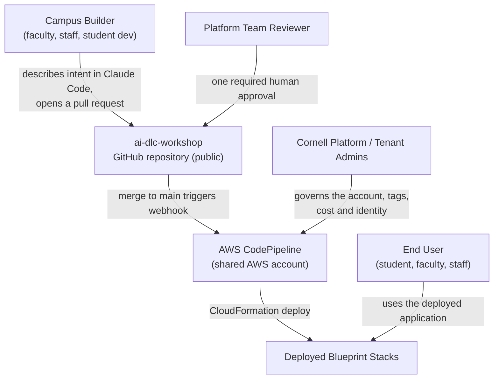

# Business Overview

## Business Context Diagram

**Text alternative**: Campus builders describe what they want in Claude Code and open a pull
request against a single public GitHub repository. A platform-team reviewer must approve it.
Merging to `main` fires a webhook into AWS CodePipeline in a shared AWS account, which
deploys blueprint stacks via CloudFormation. End users then consume the deployed
application. Cornell platform and tenant administrators govern the account, tagging, cost
and identity, but do not sit in the per-change path.

## Business Description

- **Business Description**: This system is the deploy path for Cornell's AI Platform
  **blueprint layer**, and the set of blueprints it deploys. Its purpose is to let campus
  builders compose governed, reusable building blocks into working applications **without
  ever touching AWS** — no AWS account, no console access, no click-ops. Builders hold
  PR-only write access to one repository; everything they need reaches production through
  code review and an automated pipeline. The immediate business driver is Cornell's AI-DLC
  workshop on 3-4 August 2026, where participants exercise this path live, so `main`
  staying green is a business requirement rather than a hygiene preference: every merge to
  `main` deploys into a shared AWS account used by every participant simultaneously.

- **Business Transactions**:

  | Transaction | Description |
  | --- | --- |
  | **Bootstrap an AWS account** | A platform administrator deploys `bootstrap/account-bootstrap.yml` by hand, once per account, creating the deployment role, the artifact bucket and the GitHub CodeConnections connection. Completing the connection requires a human browser handshake. |
  | **Deploy the pipeline** | The pipeline deploys itself from `pipeline/pipeline.yml` on every merge, so a change to the pipeline is delivered by the pipeline it changes. `Environment` is the branch name, which is what makes "merges to `main` deploy". |
  | **Register a blueprint** | A builder adds a CloudFormation template under `blueprints/<name>/infra/`, records it in `pipeline/stacks.yml`, and adds a matching deploy action in `pipeline/pipeline.yml`. All three steps in one pull request; the validator fails the build if they disagree. |
  | **Deploy a blueprint** | On merge, the `BlueprintDeploy` stage runs one CloudFormation action per registered blueprint, passing every parameter explicitly from the pipeline. |
  | **Validate a change before merge** | `tools/check` — run locally and by the PR check workflow — lints every template and reconciles the blueprint registry against both the filesystem and the pipeline definition. |
  | **Provision a parallel environment** | Deploying the pipeline with a different short branch name yields an independent pipeline and an independent set of `aidlc-<env>-*` stacks, isolating experimentation from the shared `main` environment. |
  | **Attribute cost and ownership** | Every deployed resource carries four `cornell:*` tags, which feed campus inventory and the cost dashboard. An untagged resource is invisible to that reporting. |

- **Business Dictionary**:

  | Term | Meaning |
  | --- | --- |
  | **Blueprint** | A reusable, governed building block — a named CloudFormation template plus any application code — that a builder composes into an application without authoring AWS infrastructure. Versioned independently via `BlueprintVersion`. |
  | **Builder** | A campus developer (faculty, staff or student) who describes intent and opens pull requests. Has no AWS account and no console access. |
  | **Platform team** | Cornell's AI Platform group. Owns the AWS account, reviews pull requests, and operates the blueprint layer. |
  | **Application** | The deployment family name, fixed at `aidlc`. Capped at 10 characters because it forms part of every stack name. |
  | **Environment** | The Git branch name that a pipeline instance tracks. Capped at four lowercase alphanumeric characters, no hyphens, because it forms part of every stack name and of the IAM resource prefix the deploy role is scoped to. |
  | **Deployment ID** | The `<application>-<environment>-<name>` triple identifying one deployed blueprint instance; also the value of the `cornell:deployment-id` tag. |
  | **Owner** | The accountable human or team for a deployed resource, supplied as a stack parameter and surfaced as the `cornell:owner` tag. |
  | **Deployed by** | Whether a template is deployed by the pipeline (`pipeline`) or by hand, once, by an administrator (`manual`). Recorded per template in `pipeline/stacks.yml`. |
  | **AI-DLC** | The AI-Driven Development Lifecycle methodology the workshop teaches, vendored verbatim into `aidlc-rules/` from `awslabs/aidlc-workflows`. |

## Component Level Business Descriptions

### `bootstrap/` — Account Bootstrap

- **Purpose**: Establishes the one-time, human-performed foundation an AWS account needs
  before any automation can run. This is the only place where a person is expected to touch
  AWS directly, and it is deliberately outside the pipeline because the pipeline depends on
  its output.
- **Responsibilities**: Create the privileged CloudFormation deployment role the pipeline
  assumes; create the versioned artifact bucket; create the GitHub source connection and
  publish its ARN for later stages to discover. Flag to the operator that the connection is
  created inert and needs a browser handshake before the pipeline can read the repository.

### `pipeline/` — Deploy Path

- **Purpose**: Converts an approved, merged pull request into deployed AWS infrastructure
  with no human in the loop after approval. This is the mechanism by which builders get
  infrastructure without AWS access.
- **Responsibilities**: Watch the tracked branch; redeploy itself so pipeline changes ship
  through the same governed path as everything else; deploy each registered blueprint;
  supply every parameter explicitly so a blueprint behaves identically deployed by hand or
  by pipeline; hold the container build capability ready for the first blueprint that needs
  a Lambda image; and enforce, through `validate_stacks.py`, that the blueprint registry,
  the filesystem and the pipeline definition tell the same story.

### `blueprints/` — Blueprint Catalogue

- **Purpose**: The reusable building blocks themselves. Today it holds one deliberately
  trivial member whose business value is proving the path end to end rather than doing
  anything useful.
- **Responsibilities**: Demonstrate the required shape of a blueprint — the four `cornell:*`
  tags, the naming convention, the parameter set, an independently bumped version — so that
  the next blueprint is a copy-and-adapt exercise rather than a design exercise. Record, via
  a deployment marker, which source commit produced the currently deployed stack.

### `aidlc-rules/` — Vendored Methodology

- **Purpose**: The AI-DLC methodology the workshop teaches, carried in-repo so participants
  and their AI agents work from one fixed, citable version.
- **Responsibilities**: Remain byte-identical to upstream so the next upstream release can
  be taken as a clean delete-and-replace. It is inert content: no code imports it, no
  pipeline stage reads it, and it is loaded into an AI session only on explicit invocation.

### `tools/check` and `.github/workflows/pr-checks.yml` — Quality Gate

- **Purpose**: Make the pre-merge check identical locally and in CI, so a builder can be
  confident before opening a pull request and a reviewer can trust a green check. Given that
  every merge to `main` deploys to a shared account, catching a defect at this gate is
  materially cheaper than catching it after merge.
- **Responsibilities**: Lint every CloudFormation template; reconcile the blueprint
  registry; run on a clean machine with `uv` as the only prerequisite.
