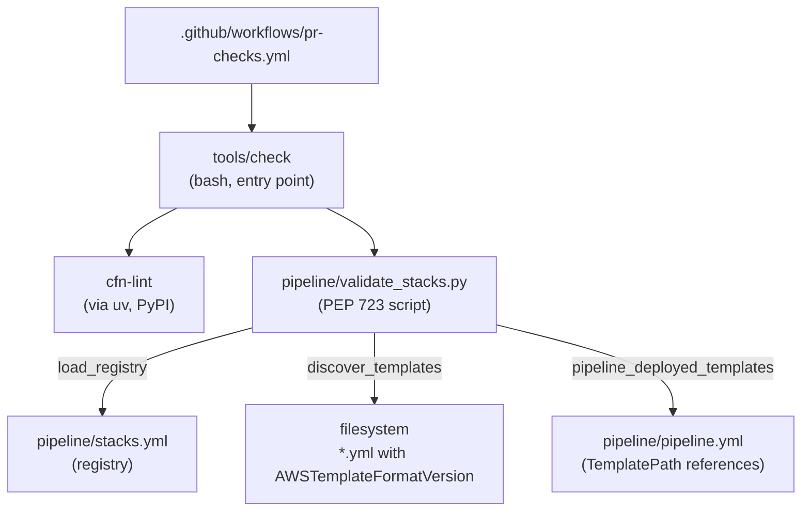

# Code Structure

## Build System

- **Type**: None conventional. There is no `pom.xml`, `package.json`, `build.gradle`,
  `pyproject.toml`, or `requirements.txt` in the repository.
- **Configuration**:
  - **Python tooling** uses **PEP 723 inline script metadata**. `pipeline/validate_stacks.py`
    carries its own dependency declaration in a comment block at the top of the file
    (`requires-python = ">=3.11"`, `dependencies = ["pyyaml"]`), and `uv` resolves it into an
    ephemeral environment at run time. There is no lockfile and nothing to install.
  - **`tools/check`** is the single build/test entry point, used identically by a developer
    before pushing and by CI. It invokes `cfn-lint` through `uv` and then
    `validate_stacks.py` through `uv`. `uv` is its only prerequisite.
  - **CloudFormation** is not "built". Templates are linted, then applied by CodePipeline.
  - **`pipeline/codebuild.yml`** is a CodeBuild buildspec for container image builds — the
    only build definition in the repository, and it is not yet invoked by any stage.

**Consequence**: the bare forms `cfn-lint …` and `python pipeline/validate_stacks.py` are not
runnable on a clean machine and must never be documented or run. `tools/check` is the
contract.

## Key Modules

**Text alternative**: `.github/workflows/pr-checks.yml` invokes `tools/check`, which runs
`cfn-lint` and then `validate_stacks.py`, both through `uv`. The validator reads three
independent sources and reconciles them: the registry `pipeline/stacks.yml`, the filesystem
(any `.yml`/`.yaml` file containing `AWSTemplateFormatVersion`), and the `TemplatePath`
references inside `pipeline/pipeline.yml`.

### Existing Files Inventory

Files a Teams chatbot blueprint would touch are marked **[MODIFY]**; files it must not touch
are marked **[FROZEN]**.

**Pipeline**

- `pipeline/pipeline.yml` — the pipeline, its IAM roles, the ECR repository and the container
  build project. **[MODIFY]** — a new blueprint needs a `BlueprintDeploy` action here, and a
  container-image blueprint needs a Build stage action. Its *mechanics* (source stage,
  artifact handling, role assumptions, digest export) are adapted from a known-good reference
  pipeline and must be preserved; change its shape only where a blueprint genuinely needs it.
- `pipeline/codebuild.yml` — container build buildspec; exports `CONTAINER_DIGEST`, requires
  `CONTAINER_TARGET` and `DATE_TAG` from the caller. Currently unreferenced by any stage.
  **[MODIFY]** only if a blueprint needs a differently-shaped image build.
- `pipeline/stacks.yml` — the template registry. **[MODIFY]** — one entry per new template,
  in the same pull request as the template.
- `pipeline/validate_stacks.py` — the registry/filesystem/pipeline reconciler. **[FROZEN]** —
  a new blueprint should satisfy it, not change it.
- `pipeline/README.md` — the three-step "adding a blueprint stack" recipe. **[MODIFY]** if the
  recipe changes.

**Bootstrap**

- `bootstrap/account-bootstrap.yml` — deploy role, artifact bucket, GitHub connection, SSM
  connection parameter. **[FROZEN]** for blueprint work; it is deployed by hand, once, and a
  change to it does not reach a bootstrapped account through the pipeline.
- `bootstrap/README.md` — bootstrap runbook including the browser handshake step.

**Blueprints**

- `blueprints/hello-world/infra/hello-world.yml` — the reference blueprint. **Read as a
  template, do not modify**: it is the canonical example of the parameter set, the four
  `cornell:*` tags in both list and map form, and the naming convention.
- `blueprints/hello-world/README.md` — what the reference blueprint proves.
- `blueprints/README.md` — blueprint conventions.

**Tooling and CI**

- `tools/check` — the only pre-push command; interposes the mandatory literal `--` before
  `cfn-lint` paths. **[FROZEN]** unless the check set itself changes.
- `.github/workflows/pr-checks.yml` — runs `tools/check` on every pull request. Constrained
  by the org allowed-actions policy to github-owned actions plus
  `hashicorp/setup-terraform@*`.
- `.claude/settings.json` — Claude Code project settings.
- `.gitignore` — Python, virtualenv, `.env*`, Terraform state, `.claude/settings.local.json`,
  editor droppings. **Does not currently ignore `docs/` or `.mcp.json`.** **[MODIFY]** —
  see the security finding in `audit.md`.

**Documentation**

- `README.md` — human onboarding; vendored-rules provenance and re-sync instructions.
- `CLAUDE.md` — the binding constraint set for AI sessions.
- `docs/WORKING-WITH-AIDLC.md` — repo guidance on driving AI-DLC well. Untracked.
- `docs/teams-chatbot-docs/*.md` — four Teams bot research documents, the domain input for
  this workflow. Untracked. **One contains live secrets** (see `audit.md`).

**Vendored**

- `aidlc-rules/**` (34 files) — verbatim copy of `awslabs/aidlc-workflows`. **[FROZEN,
  absolutely]** — not even to fix a lint or a typo. Local edits make the next upstream
  release impossible to take cleanly, and the re-sync is a delete-and-replace that would
  silently discard them.

## Design Patterns

### Self-Deploying Pipeline

- **Location**: `pipeline/pipeline.yml`, `PipelineDeploy` stage.
- **Purpose**: Ensure a change to the deploy path ships through the deploy path, so there is
  no privileged side channel and no drift between the committed pipeline definition and the
  running pipeline.
- **Implementation**: A CloudFormation `CREATE_UPDATE` action targeting the pipeline's own
  stack, ordered before `BlueprintDeploy` in the same execution, so a merge that changes both
  applies the new pipeline shape first.

### Branch-as-Environment

- **Location**: `pipeline/pipeline.yml` — `BranchName: !Ref Environment`, plus the
  `Environment` parameter in every template.
- **Purpose**: Make environment provisioning a matter of deploying the same template with a
  different parameter, rather than maintaining divergent definitions.
- **Implementation**: The `Environment` parameter is simultaneously the tracked branch name,
  a component of every stack name, and a component of the IAM resource prefix the deploy role
  is scoped to. Constrained to `[a-z0-9]{1,4}` — four characters, no hyphens — in
  `pipeline.yml` and in every blueprint template. Widening it means editing every template
  that declares the parameter, not just the pipeline. A branch named `staging` fails
  parameter validation.

### Registry Reconciliation (three-way)

- **Location**: `pipeline/validate_stacks.py`, driven by `pipeline/stacks.yml`.
- **Purpose**: Turn a class of silent failures into review-time errors. Registering a
  blueprint without adding a pipeline action produces a green pull request, every stage
  `Succeeded`, and no stack — a failure mode that is nearly impossible to diagnose from the
  pipeline console.
- **Implementation**: Three independent views (registry, filesystem, `TemplatePath`
  references in `pipeline.yml`) reconciled in both directions. The mirroring between
  `stacks.yml` and `pipeline.yml` remains hand-written on purpose; the validator makes the
  mistake loud rather than making it impossible.

### Explicit Parameter Passing

- **Location**: `ParameterOverrides` on every `BlueprintDeploy` action in `pipeline.yml`.
- **Purpose**: Guarantee a blueprint deploys identically by hand and by pipeline, so
  hand-deploying for debugging is a faithful reproduction.
- **Implementation**: The pipeline passes every parameter explicitly. Template defaults exist
  only so a stack *can* be deployed by hand; they are never the real values.

### Mandatory Four-Tag Set

- **Location**: Every resource in every blueprint template.
- **Purpose**: `cornell:owner`, `cornell:blueprint`, `cornell:blueprint-version` and
  `cornell:deployment-id` feed campus inventory and the cost dashboard. An untagged resource
  is invisible to that reporting.
- **Implementation**: Owner and deployment id arrive as stack parameters; blueprint name is
  hardcoded in the template and version is a template parameter default bumped in the pull
  request that changes the blueprint. Note the asymmetry: most resources take `Tags` as a
  list of `Key`/`Value` pairs, but **`AWS::SSM::Parameter` takes `Tags` as a map**.

### Uniform Local and CI Gate

- **Location**: `tools/check`, `.github/workflows/pr-checks.yml`.
- **Purpose**: A green check means the same thing everywhere, and a clean machine can run it.
- **Implementation**: CI installs `uv` and calls `tools/check`; the script resolves every
  tool through `uv` so nothing needs pre-installing. It also absorbs the `cfn-lint --region`
  `nargs='+'` trap: without a literal `--` before the paths, `cfn-lint` parses template paths
  as region names, lints nothing, and exits 0 — a silent pass.

### Least-Privilege by Name Prefix

- **Location**: `BuildPipelineRole` in `pipeline/pipeline.yml`.
- **Purpose**: Bound what the pipeline can touch without maintaining a per-stack allow-list.
- **Implementation**: CloudFormation permissions scoped to
  `arn:...:stack/${Application}-${Environment}*`, and the CodeBuild project name similarly
  prefixed. This is why the stack naming convention is load-bearing: a stack named outside it
  cannot be deployed by the pipeline, and the failure surfaces as an opaque authorization
  error.

## Critical Dependencies

### `uv`

- **Version**: Unpinned; whatever CI's installer and the developer's machine provide.
- **Usage**: The sole prerequisite for `tools/check`. Runs `cfn-lint` and executes
  `validate_stacks.py` with its PEP 723 dependencies resolved on the fly.
- **Purpose**: Removes the need for any committed lockfile, virtualenv, or install step.

### `cfn-lint`

- **Version**: Unpinned; resolved by `uv` at invocation.
- **Usage**: Lints every CloudFormation template in the repository, invoked by `tools/check`.
- **Purpose**: Catch template errors before a merge deploys them to a shared account.

### `pyyaml`

- **Version**: Unpinned; declared in `validate_stacks.py`'s inline metadata.
- **Usage**: Parses `pipeline/stacks.yml`.
- **Purpose**: The only third-party Python import in the repository.

### Python

- **Version**: `>=3.11`, declared as `requires-python` in the validator's inline metadata.
- **Usage**: `pipeline/validate_stacks.py` only.
- **Purpose**: Registry reconciliation.

### AWS Services (runtime dependencies of the deployed system)

- **CodePipeline** — orchestration; **CodeConnections** — GitHub source, per-account, needs a
  human browser handshake; **CloudFormation** — all deployment; **IAM**; **S3** — artifacts
  and the reference blueprint's bucket; **SSM Parameter Store** — connection ARN and
  deployment markers; **ECR** and **CodeBuild** — defined, not yet invoked; **CloudWatch
  Logs**.
