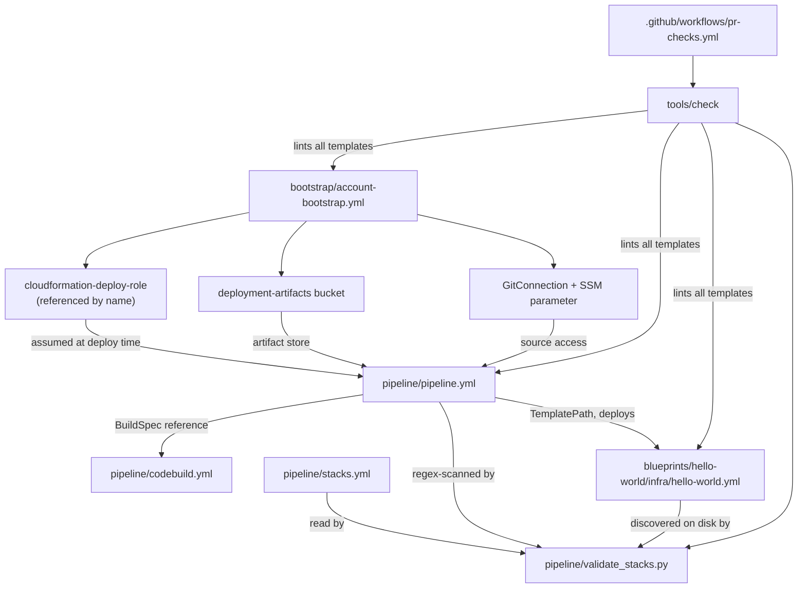

# Dependencies

## Internal Dependencies

**Text alternative**: `account-bootstrap.yml` produces three things the pipeline consumes: the
`cloudformation-deploy-role` (referenced by name, not by exported ARN), the artifact bucket,
and the GitHub connection with its SSM parameter. `pipeline.yml` references
`pipeline/codebuild.yml` as a buildspec and deploys `hello-world.yml` via a `TemplatePath`.
`validate_stacks.py` reads three independent sources — the registry `stacks.yml`, the
filesystem, and `pipeline.yml` — and reconciles them. `tools/check` runs `cfn-lint` over every
template and then the validator; the CI workflow runs `tools/check`.

### `pipeline/pipeline.yml` depends on `bootstrap/account-bootstrap.yml`

- **Type**: Deploy-time (runtime for the pipeline).
- **Reason**: The pipeline assumes `cloudformation-deploy-role` for both of its deploy stages,
  writes artifacts to the bootstrap bucket, and sources from the bootstrap connection.
- **Coupling note**: The role is referenced **by name**, constructed with `!Sub` from the
  account and partition, not imported from a CloudFormation export. This is a deliberately
  loose coupling — the pipeline stack has no dependency edge on the bootstrap stack, so
  bootstrap can be redeployed or replaced without a cross-stack lock. The cost is that a
  rename of the role breaks the pipeline at deploy time with no compile-time signal.

### `pipeline/pipeline.yml` depends on `pipeline/codebuild.yml`

- **Type**: Build-time (for container builds).
- **Reason**: `ContainerBuildProject` names `pipeline/codebuild.yml` as its buildspec. The
  buildspec in turn requires `CONTAINER_TARGET` and `DATE_TAG` from the invoking stage and
  exports `CONTAINER_DIGEST` back.
- **State**: The dependency exists in the template but is **latent** — no stage invokes the
  project, so the contract has never been exercised end to end.

### `pipeline/pipeline.yml` depends on `blueprints/*/infra/*.yml`

- **Type**: Deploy-time.
- **Reason**: Each `BlueprintDeploy` action names a template by
  `GitRepositoryArtifact::<path>` and passes every parameter explicitly via
  `ParameterOverrides`.
- **Coupling note**: This is a hand-maintained, textual reference. It is why the validator
  regex-scans `pipeline.yml` rather than interpreting it, and why a `TemplatePath` assembled
  dynamically (via `!Sub`, say) would be invisible to validation.

### `pipeline/validate_stacks.py` depends on `pipeline/stacks.yml`, the filesystem, and `pipeline/pipeline.yml`

- **Type**: Test / validation.
- **Reason**: The validator's whole purpose is to prove these three agree. It fails on an
  unregistered template on disk, a registered template that does not exist, a
  `deployed_by: pipeline` entry with no matching pipeline action, and a pipeline action with no
  registry entry.
- **Detection limits worth knowing**: filesystem discovery matches any `.yml`/`.yaml`
  containing the literal `AWSTemplateFormatVersion`, so a template omitting that key escapes
  registration entirely; and pipeline scanning is a regex over `GitRepositoryArtifact::(...)`,
  so it sees only literal paths.

### `tools/check` depends on `pipeline/validate_stacks.py` and every template

- **Type**: Test.
- **Reason**: It is the single gate. It also absorbs the `cfn-lint --region` `nargs='+'` trap
  by interposing a literal `--` before the paths — without which `cfn-lint` treats template
  paths as region names, lints nothing, and exits 0.

### `.github/workflows/pr-checks.yml` depends on `tools/check`

- **Type**: CI.
- **Reason**: CI must run exactly what a developer runs, so a green check means the same thing
  in both places.

### `blueprints/hello-world/infra/hello-world.yml` depends on nothing in-repo

- **Type**: None.
- **Reason**: Blueprints are leaves. They receive parameters and create resources. No blueprint
  imports from another, and none reads a CloudFormation export. This is what makes a blueprint
  independently deployable by hand for debugging, and it is a property worth preserving for the
  Teams chatbot blueprint.

### Dependency cycle: the pipeline deploys itself

- **Type**: Deploy-time, intentional.
- **Reason**: `PipelineDeploy` applies `pipeline.yml` to the pipeline's own stack, ordered
  before `BlueprintDeploy`. A merge changing both applies the new pipeline shape first. The
  cycle is broken at the start by one manual deployment of `pipeline.yml`; after that it is
  self-sustaining.
- **Risk**: A change that breaks the pipeline template can leave the pipeline unable to deploy
  the fix, requiring a manual out-of-band deployment to recover. This is the structural reason
  `pipeline.yml`'s mechanics are treated as frozen.

## External Dependencies

### `uv`

- **Version**: Unpinned. CI installs whatever its installer provides; a developer uses whatever
  is on their machine.
- **Purpose**: The sole prerequisite for `tools/check`. Resolves `cfn-lint` and executes
  `validate_stacks.py` with its PEP 723 inline dependencies, eliminating any lockfile,
  virtualenv, or install step.
- **License**: MIT / Apache-2.0 (dual).

### `cfn-lint`

- **Version**: Unpinned; resolved by `uv` at each invocation.
- **Purpose**: Lints every CloudFormation template. The primary defence against a merge
  breaking a shared AWS account.
- **License**: MIT-0.

### `pyyaml`

- **Version**: Unpinned; declared in `validate_stacks.py`'s inline metadata.
- **Purpose**: Parses `pipeline/stacks.yml`. The only third-party Python import in the
  repository.
- **License**: MIT.

### Python

- **Version**: `>=3.11`, declared as `requires-python`.
- **Purpose**: Runs the validator.
- **License**: PSF.

### AWS Services

Runtime dependencies of the deployed system rather than of the codebase. All in `us-east-1`.

- **In use**: CodePipeline, CodeConnections, CloudFormation, IAM, S3, SSM Parameter Store.
- **Defined but not invoked**: ECR, CodeBuild, CloudWatch Logs.

### GitHub

- **Purpose**: Source of record, review gate, and CI host.
- **Constraint**: An enforced org allowed-actions policy permits only github-owned actions plus
  `hashicorp/setup-terraform@*`. Any other `uses:` fails the whole run as `startup_failure`
  with no job logs — which reads like a broken workflow file rather than a policy denial.
  Install tools via `pip`/`run:` instead.
- **Constraint**: An enforced org security configuration **disables secret scanning**, and the
  repository is public. Nothing stops a committed credential.

## Dependency Reproducibility Assessment

Recorded because it is a real property of the current state, relevant to any decision about how
much the deploy path is trusted.

- **Nothing is pinned.** No lockfile, no version constraints, no vendored wheels. `cfn-lint`
  and `pyyaml` resolve to whatever is current at invocation.
- **Consequence**: CI is reproducible only to the extent that upstream PyPI is stable. A new
  `cfn-lint` release introducing a rule can turn a previously green `main` red without any
  repository change — and because `main` is what deploys to the shared account, that surfaces
  at an inconvenient moment.
- **Mitigating context**: the dependency surface is two packages and one script. The blast
  radius of an upstream change is small and diagnosable. This is a reasonable trade for a
  workshop repository, not an oversight to fix reflexively — but it is worth an explicit
  decision if the Teams chatbot adds runtime dependencies, where unpinned resolution has
  materially different consequences.

## Dependencies The Teams Chatbot Would Introduce

None of these has an existing pattern in the repository. Listed so the design stages price them
honestly.

| New dependency | Kind | Notes |
| --- | --- | --- |
| Microsoft Entra ID (app registration or user-assigned managed identity) | External identity | Any tenant member can create an app registration. Multi-tenant bot creation is unavailable after 31 July 2025. |
| Azure Bot Service + `MsTeamsChannel` | External service | Requires Azure **Contributor on the resource group** — an Azure RBAC role, separate from Entra and Teams roles. |
| Teams app manifest and Teams admin approval | External governance | Sideloading reaches personal scope only; group chat and channel use require publishing to the organization with admin approval. |
| Bot Framework token endpoint and JWKS | External runtime API | Outbound `client_credentials` for replies; inbound JWT validation against `https://login.botframework.com/v1/.well-known/keys`. Both are hard runtime dependencies on Microsoft availability. |
| AWS Secrets Manager | New AWS service | Required by policy for the bot's client secret. No stack in the repository reads a secret today. |
| Public HTTPS ingress (API Gateway, function URL, or ALB) | New AWS service | No ingress of any kind exists. This is the largest single gap. |
| Container image build path | Latent, needs activating | Lambda here means container images, so the dormant ECR/CodeBuild capability moves onto the critical path. |
| Terraform | New tooling | The designated mechanism for the Azure/Entra half, currently absent and listed under "deliberately not built". `hashicorp/setup-terraform@*` being pre-approved in the org policy suggests this was anticipated. |
| A JWT validation library | New runtime dependency | Inbound token validation must not be hand-rolled. Whatever is chosen becomes the repository's first pinned runtime dependency, and the reproducibility note above starts to matter. |
