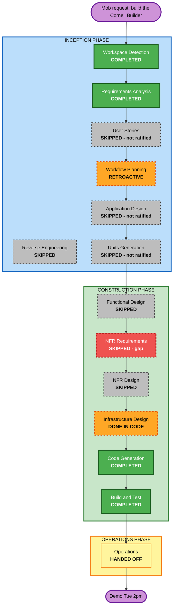

# Execution Plan — builder-mcp (Track A)

**Status**: written retroactively on 2026-08-03, after Construction had already run. Workflow
Planning is an ALWAYS-EXECUTE stage that was skipped; this document reconstructs it honestly
rather than pretending it happened on time. Its companion —
[STAGE-GATES.md](../../STAGE-GATES.md) — is the part the mob actually needs: what each stage
would have asked, what we chose, and what we *walked into* without choosing.

## Detailed Analysis Summary

### Transformation scope (brownfield)
- **Type**: new component inside an existing, working system (the deploy path)
- **Primary change**: add `builder-mcp/` — an MCP server — plus its AgentCore stack
- **Related components changed**: `pipeline/pipeline.yml` (ARM CodeBuild project, Build stage,
  BlueprintDeploy action), `pipeline/stacks.yml` (registry entry), root `Dockerfile` (new),
  `blueprints/hello-world/blueprint.yaml` (new manifest — now a frozen cross-team contract)

### Change impact assessment
| Area | Impact |
|---|---|
| User-facing | **Yes** — this *is* the builder's entire interface to the platform |
| Structural | **Yes** — first component that writes to GitHub and reads AWS on a builder's behalf |
| Data model | **Yes** — two new contracts: blueprint manifest (C1), deployment shell (C2) |
| API | **Yes** — seven MCP tools are a public API to every builder's client (C3) |
| NFR | **Yes** — inbound auth, credential custody, and the deploy-gate invariant all land here |

### Risk assessment
- **Risk level**: **High**. It holds a GitHub credential and an AWS role on behalf of users who
  have neither; a mistake in the tool surface is a governance hole, not a bug.
- **Rollback complexity**: Easy for the code (revert the PR; the stack deletes cleanly).
  *Not* easy for anything it created in GitHub — repos and PRs it opens are outside CloudFormation.
- **Testing complexity**: Moderate — 22 tests cover pure logic; the GitHub and AWS edges are
  exercised only through dry-run paths on a machine with no credentials.

## Workflow Visualization

Red = the one genuine gap (no NFR targets were ever stated). Grey = skipped without the mob
ratifying the skip. Orange = done, but out of order or inside code rather than as an artifact.

## Phases

### INCEPTION
- [x] **Workspace Detection** — COMPLETED
- [x] **Reverse Engineering** — SKIPPED. *Rationale (defensible)*: the deploy path is already
      documented in `CLAUDE.md`, `README.md`, `pipeline/README.md`.
- [x] **Requirements Analysis** — COMPLETED, with two defects: three extension opt-ins were
      never presented, and Q4 was never answered.
- [ ] **User Stories** — SKIPPED by me, **not ratified**. The method says *always execute* for
      new user-facing features with multiple personas. This has at least three personas
      (builder, reviewer, platform operator) and no acceptance criteria exist. → GATE 2.
- [x] **Workflow Planning** — this document (retroactive).
- [ ] **Application Design** — SKIPPED, **not ratified**. Five modules were designed by me alone.
- [ ] **Units Generation** — SKIPPED, **not ratified**. Treating this as one unit is what
      prevented parallel mob work. → GATE 3.

### CONSTRUCTION
- [x] **Infrastructure Design** — effectively done (AgentCore stack, IAM, pipeline wiring) but
      as code, not as a reviewed artifact.
- [ ] **NFR Requirements** — SKIPPED. **This is the real gap.** No stated targets for latency,
      concurrent builders, rate limits, or availability. → GATE 4.
- [x] **Code Generation** — COMPLETED (7 tools, 5 modules).
- [x] **Build and Test** — COMPLETED (22 tests, HTTP smoke stateful + stateless, arm64 image,
      cfn-lint clean).

### OPERATIONS
- [ ] **Operations** — handed off to Marty per `deploy/HANDOFF.md`.

## Success criteria
- **Primary goal**: demo beats 2–4 (intent → blueprint → repo + PR → pipeline) run live Tuesday.
- **Quality gates**: `tools/check` green · 22 tests green · a human approves every deployment ·
  every resource carries the four `cornell:*` tags.

## Timeline
Inception + Construction: one day (2026-08-03). Remaining: four gates in STAGE-GATES.md,
~30 minutes of mob time total.
